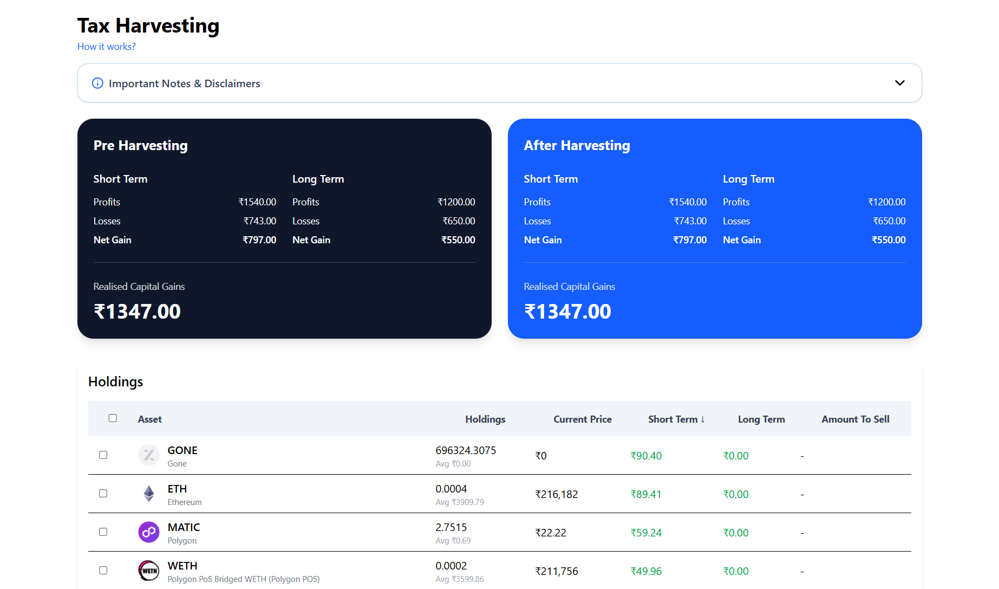

# KoinX Tax Loss Harvesting Dashboard

A responsive React.js + Tailwind CSS Tax Loss Harvesting Dashboard built as an assignment project.

The application helps users visualize capital gains before and after harvesting, select holdings for harvesting, and calculate savings in real-time.

---

## Features

### Capital Gains Dashboard

- Pre-Harvesting Capital Gains card
- After Harvesting Capital Gains card
- Real-time gain/loss updates
- Savings calculation after harvesting
- Short-term and Long-term capital gain tracking

### Holdings Table

- Holdings data rendering from Mock API
- Select individual holdings
- Select/Deselect all holdings
- Amount to sell auto-populates
- Real-time harvesting calculations
- Sort Short-Term gains Ascending / Descending
- Sort Long-Term gains Ascending / Descending
- View All / Show Less functionality
- Initially shows only 6 rows

### Responsive UI

- Mobile Responsive
- Tablet Responsive
- Desktop Responsive
- Tailwind CSS based UI

---

## Tech Stack

- React.js
- Tailwind CSS
- Vite
- JavaScript
- Lucide React Icons

---

## Folder Structure

```bash
src/
│
├── api/
│   ├── capitalGainsApi.js
│   └── holdingsApi.js
│
├── components/
│   ├── CapitalGainCard/
│   ├── HoldingsTable/
│   └── TaxHarvestInfo/
│
├── hooks/
│   └── useHarvestCalculation.js
│
├── mock/
│   └── holdings.json
│
├── pages/
│   └── Dashboard.jsx
│
├── utils/
│   └── calculation.js
│
└── App.jsx
```

---

## Installation

Clone repository:

```bash
git clone <repository-url>
```

Move into project:

```bash
cd KoinX-Ass
```

Install dependencies:

```bash
npm install
```

Install Tailwind:

```bash
npm install -D tailwindcss postcss autoprefixer
```

Install icons:

```bash
npm install lucide-react
```

Run development server:

```bash
npm run dev
```

Open:

```

http://localhost:5173

```

---

## Mock APIs

### Capital Gains API

Returns:

```javascript
{
 stcg:{
   profits:1540,
   losses:743
 },

 ltcg:{
   profits:1200,
   losses:650
 }
}
```

### Holdings API

Provides holdings list with:

- Asset Name
- Logo
- Current Price
- Holdings
- Average Buy Price
- STCG Gain
- LTCG Gain

---

## Tax Harvesting Logic

For selected assets:

- Positive gains → Added to profits
- Negative gains → Added to losses

Formula:

```

Net Capital Gain = Profits - Losses

Realised Capital Gain =
Short Term Net Gain +
Long Term Net Gain

Savings =
Pre Harvest Gain -
Post Harvest Gain

```

---

## Screenshots

### Dashboard UI



---

## Future Improvements

- API integration
- Pagination
- Search Holdings
- Filters
- Dark Mode
- Export Tax Report

---

## Author

Built by <Vivek Kumar>

Assignment Project for KoinX.